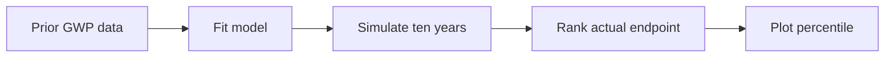
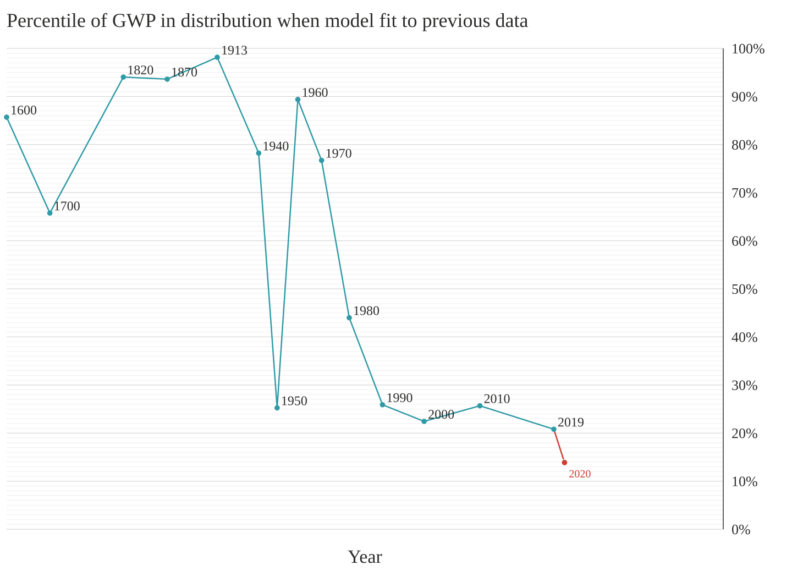
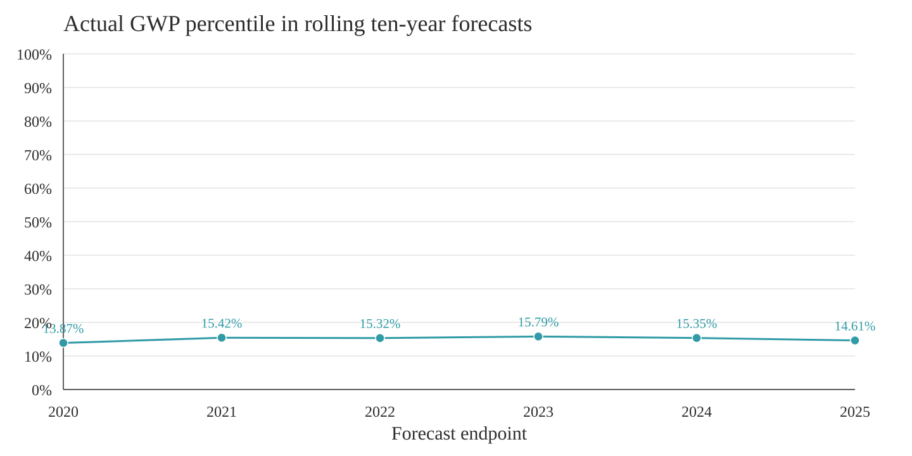

# Extend GWP prediction-percentile analysis through 2025

## Summary

This PR reproduces the stochastic GWP model behind the paper's rolling
prediction-percentile chart and extends the analysis in two ways:

1. It adds **2020** as the next complete decennial observation after 2010.
2. It adds a separate **rolling ten-year analysis for 2020-2025**, allowing
   recent outcomes to be compared over a consistent forecast horizon.

The two results are presented separately because the first continues the
paper's preferred modern observation cadence, while the second is a new
diagnostic using overlapping ten-year windows.

## What the percentile means

For each forecast:

1. Fit the stochastic GWP model using only information available through the
   starting year.
2. Generate 10,000 possible ten-year trajectories.
3. Locate actual GWP at the end of the decade within those simulated endpoints.
4. Plot that rank as the actual GWP percentile.

A result of 15% means actual GWP exceeded approximately 15% of the model's
simulated endpoints and fell below approximately 85%.

## Figure 1: Original series with the 2020 checkpoint

The original rolling prediction-percentile figure is preserved through 2019.
One new dot is added:

| Dot | Fit through | Simulate | Horizon | Actual percentile |
| ---: | ---: | ---: | ---: | ---: |
| 2019 | 2010 | 2010-2019 | 9 years | 20.71% |
| **2020** | **2010** | **2010-2020** | **10 years** | **13.87%** |

The 2020 observation completes the next full ten-year interval after 2010. It
continues the pattern identified in the paper: recent GWP has been lower than
the model's historical acceleration mechanism predicted.

## Figure 2: Rolling ten-year forecasts through 2025

A companion chart applies a constant ten-year forecast horizon to each recent
endpoint:

| Dot | Fit through | Simulate | Horizon | Actual percentile |
| ---: | ---: | ---: | ---: | ---: |
| 2020 | 2010 | 2010-2020 | 10 years | 13.87% |
| 2021 | 2011 | 2011-2021 | 10 years | 15.42% |
| 2022 | 2012 | 2012-2022 | 10 years | 15.32% |
| 2023 | 2013 | 2013-2023 | 10 years | 15.79% |
| 2024 | 2014 | 2014-2024 | 10 years | 15.35% |
| 2025 | 2015 | 2015-2025 | 10 years | 14.61% |

## Interpretation

Across every ten-year window ending from 2020 through 2025, actual GWP lands
near the 14th-16th percentile of the model's simulated distribution.

The result suggests that the recent economy has remained persistently below
the model-implied trajectory. Because adjacent windows share nine of their ten
years, the cluster should be interpreted as **one sustained period of
lower-than-predicted growth viewed from several nearby starting points**.

COVID contributes to the low 2020 endpoint, but does not by itself explain the
finding. Similar percentiles remain visible in windows ending through 2025.

## Reproduction validation

Before producing the extension, the implementation reproduces the archived
Stata estimates closely:

| Parameter | Reproduction | Archived estimate |
| --- | ---: | ---: |
| `log a` | -12.6613 | -12.66 |
| `b` | 0.000018571 | 0.0000186 |
| `nu` | -23.7788 | -23.78 |
| `gamma` | -1.81289 | -1.813 |

It also reproduces the published 2019 rolling forecast percentile:

| Result | Reproduction | Published figure |
| --- | ---: | ---: |
| 2019 percentile | 20.71% | approximately 20.8% |

These checks establish that the extension is using the same model mechanics
before introducing newer GWP observations.

## Recent data

World Bank series `NY.GDP.MKTP.PP.KD` supplies annual world GDP growth for the
update. These values are chain-linked to the paper workbook's 2019 GWP level.

The frozen source response is stored in:

`data-update/world-bank-gwp-2019-2025.json`

## Deliberate limitations

- The rolling ten-year windows overlap and must not be treated as statistically
  independent observations.
- Annual starting points from 2011-2015 make Figure 2 a new robustness
  analysis, not a literal continuation of the paper's preferred decennial
  sample.
- The results measure where actual GWP falls within model-generated
  distributions. They do not identify the causes of slower growth.
- This PR does not revise the median takeoff year, probability of no takeoff,
  or the paper's other stochastic-model estimates.
- The five-year 2020-2025 forecast and annual one-step forecasts are excluded
  from the main presentation because their horizons are not comparable with
  the ten-year results.

## Files changed

- `scripts/update_gwp_prediction_percentiles.py`
- `data-update/world-bank-gwp-2019-2025.json`
- `reference-output-sample/gwp-prediction-percentiles-through-2020.svg`
- `reference-output-sample/gwp-ten-year-rolling-percentiles-2020-2025.svg`
- `README.md`
