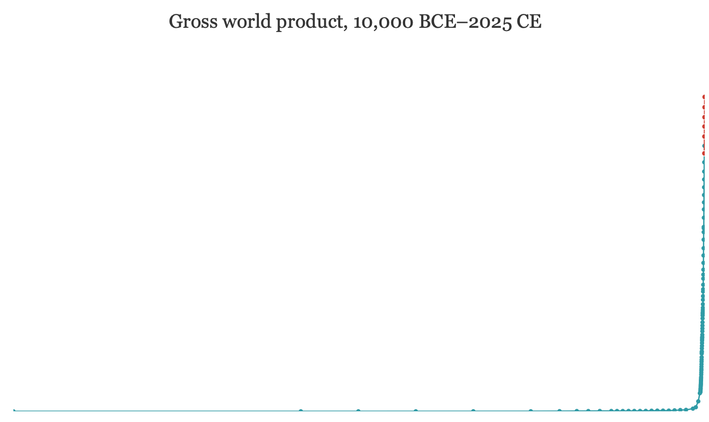
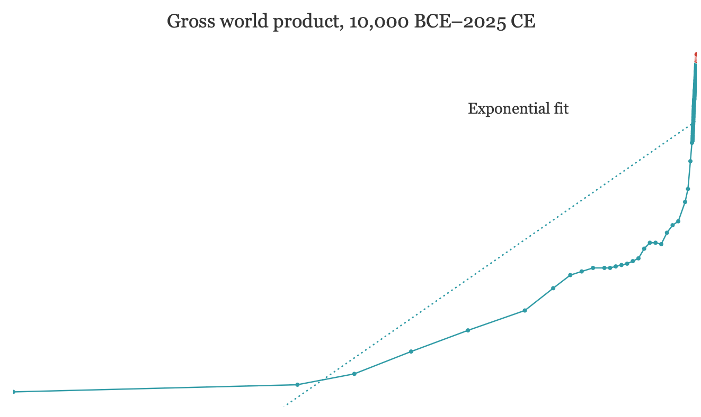
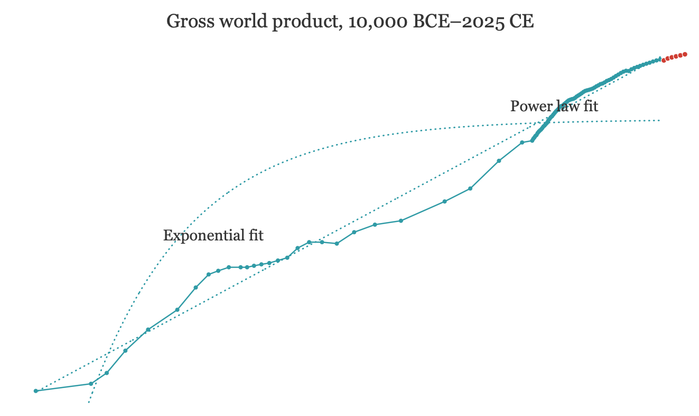

# Visual GWP update through 2025

This optional helper produces a **visual extension** of the GWP chart after the
workbook's 2019 endpoint. It deliberately does not modify `GWP.xlsx`, rerun
the Stata estimation, or claim a revised explosion-date estimate.

## What is preserved

`scripts/plot_gwp_extension.py` reimplements the historical GWP construction
used by the first `PrepData` pass in `Model GWP.do`. The result at the join
point is 73,639.626532 billion 1990 international dollars for 2019.

## What is added

`world-bank-world-gdp-ppp-constant-2021-2019-2025.json` is the saved World
Bank WDI response for `NY.GDP.MKTP.PP.KD` (world GDP at PPP, constant 2021
international dollars). The script keeps its 2020–2025 growth rates, but
chain-links its level to the historical series at 2019. The resulting red
points are therefore a transparent visual update, not a claim that the two
series have identical level construction.

## Visual comparisons

The review surface is the three-chart sequence used in the article—not the
single archived repository output. In every after chart, teal is the generated
historical reconstruction through 2019 and red is the distinct 2020–2025
extension.

| View | Before: published 2019 article chart | After: generated 2025 extension |
| --- | --- | --- |
| Ordinary axes |  |  |
| Log y-axis / exponential fit |  |  |
| Transformed time / power fit |  |  |

The published “before” PNGs are deliberately referenced at the author's URLs
rather than copied into this repository. The generated “after” SVG and PNG
files are stored locally in
`reference-output-sample/article-chart-reconstructions/`.

## Run

```sh
python3 scripts/plot_gwp_extension.py
```

The script requires `numpy`, `pandas`, and an engine capable of reading the
existing `.xlsx` workbook. It rewrites only the generated CSV and SVG in this
folder and `reference-output-sample/`.

## Deliberate limitation

This is not a replacement for a full 2025 paper update. That would require a
reviewed decision about new GWP inputs and a rerun of the full Stata model,
including its fitted parameters and uncertainty calculations.
